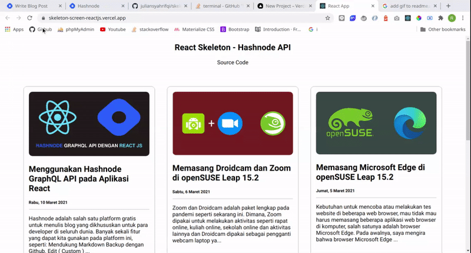

**Preview**

You can check live demo from this project in here
[https://skeleton-screen-reactjs.vercel.app/](https://skeleton-screen-reactjs.vercel.app/)

# Getting Started with Create React App

This project was bootstrapped with [Create React App](https://github.com/facebook/create-react-app).

## Available Scripts

In the project directory, you can run:

### `npm install`

For installing all depedency

### `npm start`

Runs the app in the development mode.\
Open [http://localhost:3000](http://localhost:3000) to view it in the browser.

The page will reload if you make edits.\
You will also see any lint errors in the console.
